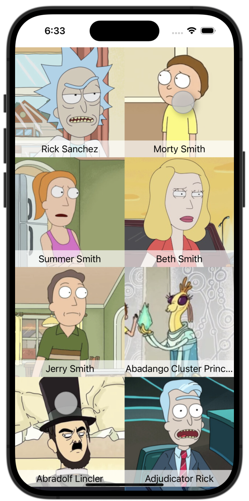
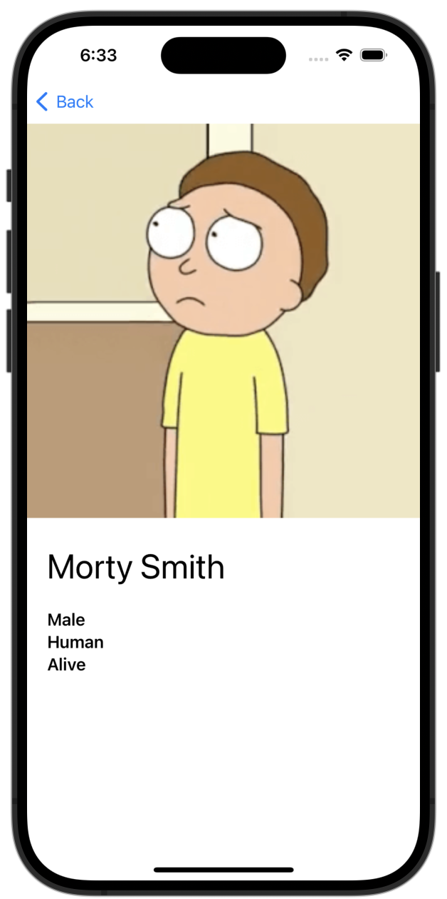

# Rick and Morty App

A simple app that pulls character data from the [Rick and Morty
API](https://rickandmortyapi.com/about) and displays it in a grid view.  You
can click on the thumbnails to get more detail about a specific character.

The code is intended to showcase a simple list/detail iOS app that makes
mainstream and modern tech choices ("best practices") in iOS development as of
Q4 2023.

## Technical Choices

- "Offline-first" operation with SwiftData
- SwiftUI w/ [Observation](https://developer.apple.com/documentation/observation)
- MVVM w/ uni-directional data flow
- [Loading/Content/Error](https://medium.com/trendyol-tech/simple-ui-problem-states-loading-error-empty-and-content-cbf924b39fcb) pattern in UI & Data layers
- [NavigationStack Router](https://blorenzop.medium.com/routing-navigation-in-swiftui-f1f8ff818937)
- [Alamofire](https://github.com/Alamofire/Alamofire)
- [Swift async/await](https://www.hackingwithswift.com/swift/5.5/async-await)

## To do
- Tests

